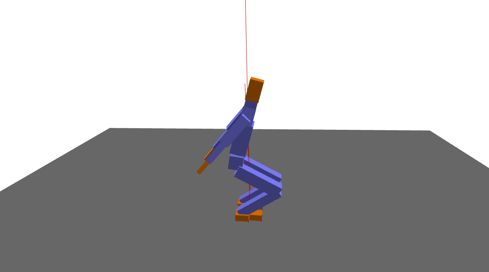

Biped Jump: Using Jacobian
====================================================
This example demonstrates a jumping controller using Jacobian transpose.

Screenshot
^^^^^^^^^^^^

Code
^^^^^^^^^^^^

.. code-block:: python
   :linenos:

    import pydart2 as pydart
    import numpy as np

    class JTController:
        """
        # Usage
        self.jt = JTController(self.skel)
        tau += self.jt.apply( ["l_hand", "r_hand"], f )
        """
        def __init__(self, _skel):
            self.skel = _skel

        def apply(self, bodynames, f):
            if not isinstance(bodynames, list):
                bodynames = [bodynames]
            f = np.array(f)

            tau = np.zeros(self.skel.ndofs)
            for bodyname in bodynames:
                J = self.skel.body(bodyname).linear_jacobian()
                JT = np.transpose(J)
                tau += JT.dot(f)
            return tau

    class Controller:
        def __init__(self, skel, h):
            self.h = h
            self.skel = skel
            ndofs = self.skel.ndofs
            self.qhat = self.skel.q
            self.Kp = np.diagflat([0.0] * 6 + [600.0] * (ndofs - 6))
            self.Kd = np.diagflat([0.0] * 6 + [40.0] * (ndofs - 6))

            # Init target poses
            self.init_target_poses()
            # Jacobian transpose
            self.jt = JTController(self.skel)

        def init_target_poses(self):
            skel = self.skel
            I_thigh = skel.dof_indices(["j_thigh_left_z", "j_thigh_right_z"])
            I_shin = skel.dof_indices(["j_shin_left", "j_shin_right"])
            I_heel = skel.dof_indices(["j_heel_left_1", "j_heel_right_1"])

            pose0 = self.skel.q
            pose0[I_thigh] = 1.2
            pose0[I_shin] = -2.0
            pose0[I_heel] = 0.8
            pose0[('j_bicep_left_y', 'j_bicep_right_y')] = 0.5, -0.5

            pose1 = self.skel.q
            pose1[('j_bicep_left_y', 'j_bicep_right_y')] = -2.0, 2.0
            pose1[('j_bicep_left_x', 'j_bicep_right_x')] = 0.5, -0.5

            pose2 = self.skel.q
            pose2[I_thigh] = 0.3  # Thighs

            self.target_poses = [pose0, pose1, pose2]
            self.target_times = [0.0, 0.4, 0.8]

        def update_target_pose(self):
            if len(self.target_times) == 0:
                return
            t = self.skel.world.t
            if self.target_times[0] <= t:
                self.qhat = self.target_poses[0]
                print('update pose! at %.4lf' % t)
                self.target_poses.pop(0)
                self.target_times.pop(0)

        def compute(self):
            self.update_target_pose()
            skel = self.skel

            invM = np.linalg.inv(skel.M + self.Kd * self.h)
            p = -self.Kp.dot(skel.q + skel.dq * self.h - self.qhat)
            d = -self.Kd.dot(skel.dq)
            qddot = invM.dot(-skel.c + p + d + skel.constraint_forces())
            tau = p + d - self.Kd.dot(qddot) * self.h

            t = self.skel.world.t
            if 0.3 < t and t < 0.5:  # Jump!
                heels = ['h_heel_left', 'h_heel_right']
                vf = self.jt.apply(heels, [0, -700, 0])
                tau += vf

            # Make sure the first six are zero
            tau[:6] = 0
            return tau

    if __name__ == '__main__':
        print('Example: bipedJump')

        pydart.init()
        print('pydart initialization OK')

        world = pydart.World(1.0 / 2000.0, './data/skel/fullbody1.skel')
        print('pydart create_world OK')

        # Initialize the pose
        skel = world.skeletons[1]
        q = skel.q
        q[(2, 4, 5)] = [0.02 * np.pi, -0.02, 0]
        skel.set_positions(q)
        print('skeleton position OK')

        # Initialize the controller
        skel.set_controller(Controller(skel, world.dt))
        print('create controller OK')

        pydart.gui.viewer.launch(world)
