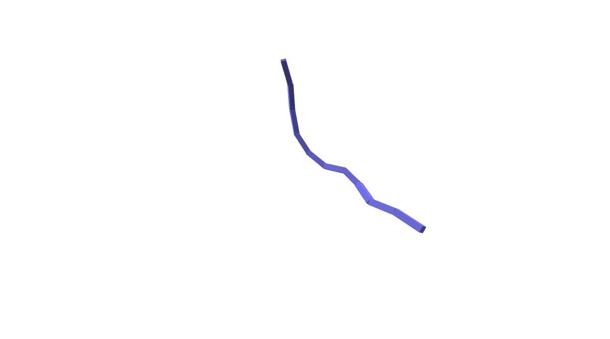

Chain: A basic controller
===================================
This example demonstrates a simple damping controller for a single chain.

Screenshot
^^^^^^^^^^^^

Code
^^^^^^^^^^^^

.. code-block:: python
   :linenos:

    import numpy as np

    class DampingController:
        """ Add damping force to the skeleton """
        def __init__(self, skel):
            self.skel = skel

        def compute(self):
            damping = -0.01 * self.skel.dq
            damping[1::3] *= 0.1
            return damping

    if __name__ == '__main__':
        import pydart2 as pydart

        pydart.init(verbose=True)
        print('pydart initialization OK')

        world = pydart.World(1.0 / 5000.0, './data/skel/chain.skel')
        print('pydart create_world OK')

        skel = world.skeletons[0]
        skel.q = (np.random.rand(skel.ndofs) - 0.5)
        print('init pose = %s' % skel.q)
        skel.controller = DampingController(skel)

        pydart.gui.viewer.launch(world)
