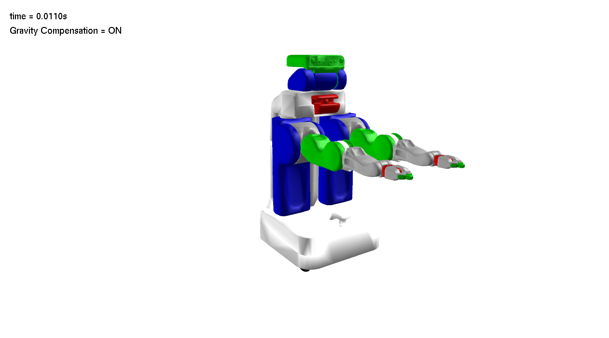

Gravity Compensation Control with a PR2 arm
====================================================
This example demonstrates a gravity compensation controller with a PR-2 robot arm.
Please make sure that you downloaded the URDF files from:
https://github.com/sehoonha/pydart2/tree/master/examples/data

Screenshot
^^^^^^^^^^^^

Youtube link:
https://youtu.be/wzzIyDvc5hQ

Code
^^^^^^^^^^^^

.. code-block:: python
   :linenos:

   # Copyright (c) 2015, Disney Research
   # All rights reserved.
   #
   # Author(s): Sehoon Ha <sehoon.ha@disneyresearch.com>
   # Disney Research Robotics Group
   import pydart2 as pydart
   import numpy as np

   class GravityCompensationController(object):

       def __init__(self, robot):
           self.robot = robot
           self.g = self.robot.world.gravity()
           self.enabled = True

       def compute(self, ):
           tau = np.zeros(self.robot.num_dofs())
           if not self.enabled:
               return tau

           for body in self.robot.bodynodes:
               m = body.mass()  # Or, simply body.m
               J = body.linear_jacobian(body.local_com())
               tau += J.transpose().dot(-(m * self.g))
           return tau

   class MyWorld(pydart.World):

       def __init__(self, ):
           pydart.World.__init__(self, 0.001)
           self.set_gravity([0.0, 0.0, -9.81])
           print('pydart create_world OK')

           self.robot = self.add_skeleton("./data/urdf/PR2/pr2.urdf")
           print('pydart add_skeleton OK')

           # Lock the first joint
           self.robot.joints[0].set_actuator_type(pydart.joint.Joint.LOCKED)

           # Move bit lower (for camera)
           positions = self.robot.positions()
           positions['rootJoint_pos_z'] = -0.6
           self.robot.set_positions(positions)

           # Initialize the controller
           self.controller = GravityCompensationController(self.robot)
           self.robot.set_controller(self.controller)
           print('create controller OK')

       def on_key_press(self, key):
           if key == 'G':
               self.controller.enabled = not self.controller.enabled

       def draw_with_ri(self, ri):
           ri.set_color(0, 0, 0)
           ri.draw_text([20, 40], "time = %.4fs" % self.t)
           ri.draw_text([20, 70], "Gravity Compensation = %s" %
                        ("ON" if self.controller.enabled else "OFF"))

   if __name__ == '__main__':
       print('Example: gravity compensation')

       pydart.init()
       print('pydart initialization OK')

       world = MyWorld()

       win = pydart.gui.viewer.PydartWindow(world)
       win.camera_event(1)
       win.set_capture_rate(10)
       win.run_application()
