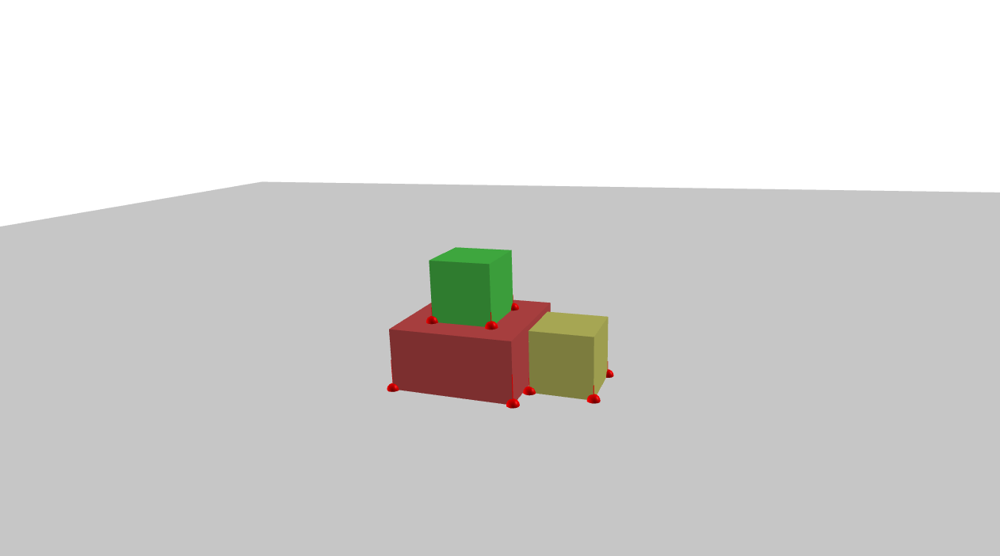

Cubes: Hello, PyDART!
===================================
This example loads the simulation of cubes and runs it for 2 seconds.

Screenshot
^^^^^^^^^^^^

Code
^^^^^^^^^^^^

.. code-block:: python
   :linenos:

    import pydart2 as pydart

    if __name__ == '__main__':
        print('Hello, PyDART!')

        pydart.init()
        print('pydart initialization OK')

        world = pydart.World(1.0 / 2000.0, './data/skel/cubes.skel')
        print('pydart create_world OK')

        while world.t < 2.0:
            if world.nframes % 100 == 0:
                skel = world.skeletons[-1]
                print("%.4fs: The last cube COM = %s" % (world.t, str(skel.C)))
            world.step()
