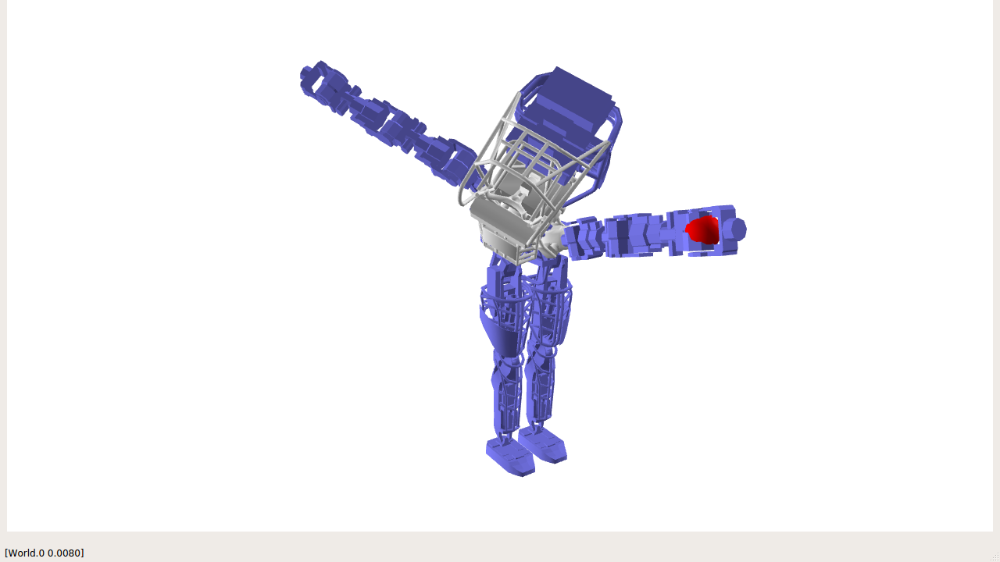

Inverse Kinematics
====================================================
This example demonstrates how to solve inverse kinematics of Atlas.
It solves the problem using Sequential Quadratic Programming from the scipy.optimize package.

Screenshot
^^^^^^^^^^^^

Code
^^^^^^^^^^^^

.. code-block:: python
   :linenos:

   class MyWorld(pydart.World):

       def __init__(self, ):
           pydart.World.__init__(self, 0.001)
           self.set_gravity([0.0, 0.0, -9.81])
           print('pydart create_world OK')

           filename = "./data/sdf/atlas/atlas_v3_no_head.sdf"
           self.robot = self.add_skeleton(filename)
           self.robot.set_root_joint_to_trans_and_euler()
           print('pydart add_skeleton OK')

           self.theta = 0.0 * np.pi
           self.update_target()
           self.solve()

           print("click step to rotate the target")

       def update_target(self, ):
           th, r = self.theta - 0.5 * np.pi, 0.6
           x, y = r * np.cos(th) + 0.4, r * np.sin(th)
           self.target = np.array([x, y, 0.3])

       def set_params(self, x):
           q = self.robot.positions()
           q[6:] = x
           self.robot.set_positions(q)

       def f(self, x):
           self.set_params(x)

           lhs = self.robot.body("l_hand").to_world([0.0, 0.0, 0.0])
           rhs = self.target
           return 0.5 * np.linalg.norm(lhs - rhs) ** 2

       def g(self, x):
           self.set_params(x)

           lhs = self.robot.body("l_hand").to_world([0.0, 0.0, 0.0])
           rhs = self.target
           J = self.robot.body("l_hand").linear_jacobian()
           g = (lhs - rhs).dot(J)[6:]

           DEBUG = True
           if DEBUG:  # Debug by comparing with the numerical computation
               from pydart2.utils.misc import grad
               lhs = g
               rhs = grad(self.f, x, 1e-5)
               print(lhs)
               print(rhs)
               print("OK" if np.allclose(lhs, rhs) else "NG!!!!")

           return g

       def solve(self, ):
           res = minimize(self.f,
                          x0=self.robot.positions()[6:],
                          jac=self.g,
                          method="SLSQP")
           print(">>> theta = %.4f" % self.theta)
           print(res)

       def step(self, ):
           super(MyWorld, self).step()
           self.theta = (self.theta + pydart.utils.misc.deg2rad(10)) % np.pi
           self.update_target()
           self.solve()

       def render_with_ri(self, ri):
           ri.set_color(1.0, 0.0, 0.0)
           ri.render_sphere(self.target, 0.05)

   if __name__ == '__main__':
       print('Example: inverse kinematics')

       pydart.init()
       print('pydart initialization OK')

       world = MyWorld()

       win = pydart.gui.pyqt5.window.PyQt5Window(world)
       win.scene.set_camera(1)  # Z-up Camera
       win.run()
