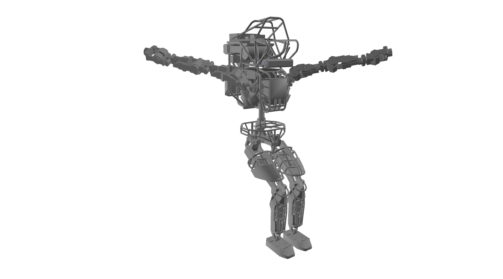

Simple Tracking: Robot configuration and PD tracking
====================================================
This example demonstrates a PD-controller in zero gravity.
Please note that the numeric vector of target positions can be configured
semantically with names of degrees of freedom.

Screenshot
^^^^^^^^^^^^

Code
^^^^^^^^^^^^

.. code-block:: python
   :linenos:

    import pydart2 as pydart
    import numpy as np

    class Controller:
        def __init__(self, skel):
            self.skel = skel
            self.target = None
            self.Kp = np.array([0.0] * 6 + [400.0] * (self.skel.ndofs - 6))
            self.Kd = np.array([0.0] * 6 + [40.0] * (self.skel.ndofs - 6))

        def compute(self):
            return -self.Kp * (self.skel.q - self.target) - self.Kd * self.skel.dq

    if __name__ == '__main__':
        print('Example: bipedStand')

        pydart.init()
        print('pydart initialization OK')

        world = pydart.World(1.0 / 2000.0)
        world.set_gravity([0.0, 0.0, 0.0])
        print('World OK')

        skel = world.add_skeleton('./data/sdf/atlas/atlas_v3_no_head.sdf')
        print('Skeleton = ' + str(skel))

        # Set joint damping
        for dof in skel.dofs:
            dof.set_damping_coefficient(80.0)

        # Set target pose
        target = skel.positions()
        target[("l_arm_shy", "r_arm_shy")] = -1.0, 1.0
        target[("l_leg_hpy", "r_leg_hpy")] = -1.0, -1.0
        target[("l_leg_kny", "r_leg_kny")] = 1.0, 1.0

        # Initialize the controller
        controller = Controller(skel)
        controller.target = target
        skel.set_controller(controller)
        print('create controller OK')

        pydart.gui.viewer.launch(world,
                                 default_camera=1)  # Use Z-up camera
