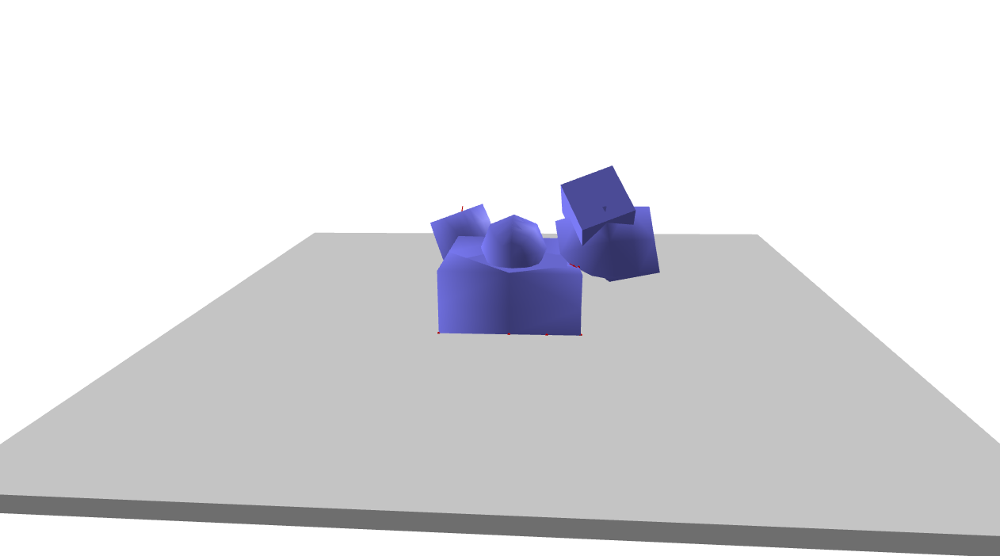

Soft Bodies: Softbody simulation
===================================
This example loads the simulation of soft bodies

Screenshot
^^^^^^^^^^^^

Code
^^^^^^^^^^^^

.. code-block:: python
   :linenos:

    import pydart2 as pydart
    if __name__ == '__main__':
        pydart.init()
        print('pydart initialization OK')

        world = pydart.World(1.0 / 2000.0, './data/skel/softBodies.skel')
        print('pydart create_world OK')

        pydart.gui.viewer.launch(world)
