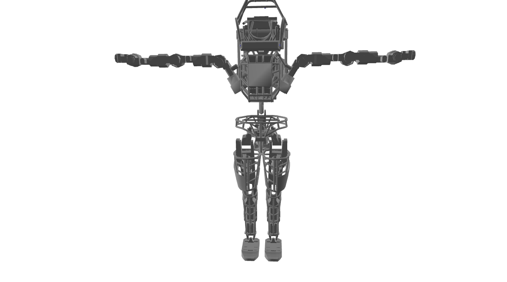

Skeleton Viewer: A basic GUI
===================================
This example demonstrates how to load a skeleton, and visualize it using GUI.
The following screenshot is the result of the following command.

.. code-block:: bash

   python view_skeleton.py data/sdf/atlas/atlas_v3_no_head.sdf

Note: you need to rotate the camera using drag, shift-drag, and control-drag.

Screenshot
^^^^^^^^^^^^

Code
^^^^^^^^^^^^

.. code-block:: python
   :linenos:

    if __name__ == '__main__':
        import sys
        import pydart2 as pydart

        if len(sys.argv) != 2:
            print("Usage: view_skeleton.py [*.urdf/*.sdf]")
            exit(0)

        skel_path = sys.argv[1]
        print("skeleton path = %s" % skel_path)

        pydart.init()
        print("Pydart init OK")

        world = pydart.World(1.0 / 1000.0)
        print("World init OK")

        skel = world.add_skeleton(skel_path)
        print("Skeleton add OK")

        print("Camera:")
        print("    drag: rotate camera")
        print("    shift-drag: zoom camera")
        print("    control-drag: translate camera")

        pydart.gui.viewer.launch(world)
